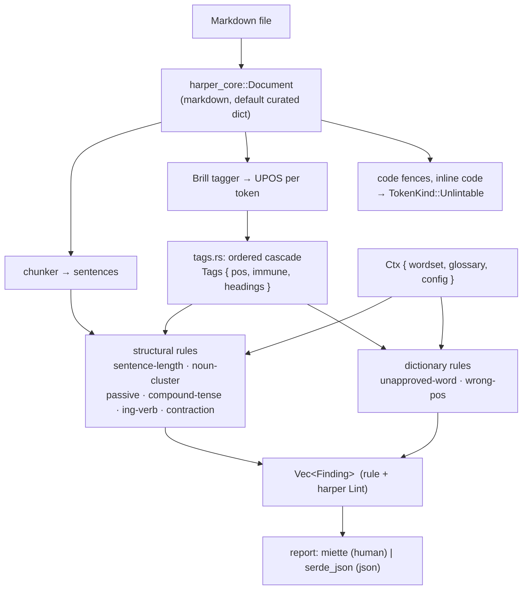

# Architecture

Where this is going, and the measured gaps that decide the order: [ROADMAP.md](./ROADMAP.md).

## Bird's eye view

ASD-STE100 restricts English to one meaning per word, one part of speech per word, short
sentences and the active voice. Roughly ten of its 53 rules are decidable from a
part-of-speech tag and a wordlist; the rest need a reader. This crate implements the ten.

Everything upstream of the rules is Harper's: it parses the Markdown (so code fences never
reach a rule), tags every word with a Universal Dependencies POS, and splits sentences. Harper's
`UPOS` is the same tagset openSTE annotates its wordlist with, so there is no mapping layer —
only an equivalence table for the places where the standard is coarser than UD, and a cascade
(`tags.rs`) over the places where the tagger is simply wrong.

## Code map

### `wordset.rs`
Loads the vendored openSTE wordlist once, into `HashMap<word, (approved, POS)>` plus a
replacement table. **Each row restricts one (word, part of speech) pair, not the word.**
`work/VERB/unapproved` means *work* is a fine noun and a forbidden verb; matching without
the tag flags both, which is the failure this whole design exists to avoid.

`equivalent()` is the bridge between UD's tagset and the standard's: modals are verbs,
possessives are adjectives, particles and subordinators are not separate categories. It is not
what `tags.rs` replaces — the cascade normalises the tag a rule *sees*, this maps *categories*,
and rule 4 of the cascade depends on `(SCONJ, CCONJ)` surviving. Nine pairs remain; `(ADP, ADV)`
and `(ADV, ADP)` were deleted once measurement showed they suppressed nothing.

### `tags.rs`
An ordered, cascading disambiguator after LanguageTool's `en/disambiguation.xml`. Harper's tokens
are immutable from outside its crate, so `Tags` is a side table indexed by `doc.get_tokens()`,
and the rules read it instead of `pos_tag`.

`immune` is LT's `action="immunize"` — hyphenated-compound halves the tokenizer split, and past
participles `passive-voice` already owns. The dictionary rules honour it; `prose_words()` does
not filter on it, because `aux_pairs` is positional and dropping tokens would invent pairs.

Four retagging rules, in order: imperative, subordinator, quantifier, noun run. One
left-to-right pass, at most one write per token, and a rule may only move a token to a part of
speech the curated dictionary already admits for it. No fixpoint: two rules that need each
other's output would be a bug in the pair, not a reason for a loop.

### `rules/`
Each rule is `fn(&Document, &Tags, &Ctx) -> Vec<Lint>`, collected in `RULES`. Not `impl Linter`:
that trait takes only `&mut self, &Document`, and every rule here needs the glossary.
`Lint` itself is reused from Harper for its span, message and suggestion machinery.

`prose_words()` is the shared entry point — `(index, token)` for word tokens outside headings.
Section titles are not sentences, and in the README case `readme_fw` generates them.

`noun_cluster` counts maximal runs of NOUN over `Tags`, not `iter_nominal_phrases`: the chunker's
`np_member` is a second tagger output, broken by the same errors and not rewritten by the cascade.

### `report.rs`
Harper spans are **char** indices into the original source; miette and editors want
**bytes**. One `ByteOffsets` table per file converts them, with an assertion that the result
lands on a character boundary.

## Invariants

- **The tool is an aid, not a gate.** Findings are warnings and the exit code is 0 unless
  `--deny`. The cascade narrows the tagger's errors but cannot close them; a checker that cannot
  be wrong would have to be far weaker.
- **Spans index the original text**, never a rendered form, so an editor can act on them.
- **No fallback on a bad wordset.** `wordset.rs` asserts on load that the vendored file still
  has its shape; if upstream changes, the process dies rather than checking against a
  half-loaded dictionary.
- **The glossary is part of the design, not a workaround.** ASD-STE100 provides for a
  per-project list of Technical Names and Technical Verbs. Without one, a software repo's own
  vocabulary buries every real finding.
- **The corpus counts in `ste_checker/tests/integration/main.rs` are a snapshot, not a target.** They
  exist so that a change to the wordset, the equivalence table or a rule moves a visible
  number. Do not adjust a rule to make them go down.

## Cost

Model load ≈600 ms once per process; lint ≈100 µs per file; wordset load ≈2.6 ms. Pass every
file to one invocation.
