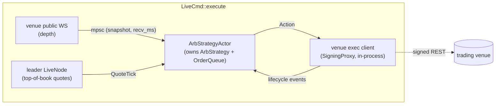

# Architecture

The live arb runtime owns the strategy loop. Two venue ROLES, never named
venues, define the architecture:

- **Trading venue** (`AppConfig.venue`) — the venue carrying the value leg:
  its quotes lag the leader, so the discrepancy IS the edge, and it's the only
  venue we trade on. The inefficiency closes on its own; hedging the leader
  leg would be ~0 EV for double the execution surface. Concrete adapters live
  behind the `adapters` seam.
- **Leader exchange** (`AppConfig.leader`) — the reference oracle whose
  top-of-book the trading venue chases. Data-only: we never hold an account
  there.

All halves run under one `tokio::join!`/`select!` (no `tokio::spawn`).



`ArbStrategy` is a pure state machine (`crates/strategy/src/arb.rs`): events
in, `Vec<Action>` out, no IO. The actor translates each `Action` through the
`OrderQueue` into venue submits/cancels/modifies and feeds the lifecycle
outcomes back in as `Event::Slot`s. See `docs/strategy.md` for the strategy
spec and `crates/strategy/src/ARCHITECTURE.md` for the queue/decision
invariants.

## Invariants
- UNDER NO CIRCUMSTANCES can ANY order modifications be signed through HMAC. ALL MUTABLE OPERATIONS must use BROWSER TOKEN signing. ALL. NO EXCEPTIONS. This is THE MOST IMPORTANT invariant of the entire project. NOTHING works without this. NO CHANGES are ever justified if they put this invariant at even a risk of being broken.

- if a piece of functionality mutating orders can't be done without HMAC, it shall be rejected on the spot.

- **Trading decisions (entry signals, exit reprices, ANY emitted `Action`) fire
  EXCLUSIVELY on trading-venue quote events and the local Tick.
  Reference/leader quotes may ONLY update the cached leader top-of-book; the
  ref-quote path returns nothing and has no access to the state machine. NO
  EXCEPTIONS.** A leader quote is the exact quote whose staleness we cannot
  bound at action time — acting on it directly is trading on data of unknown
  age. Enforced by type in `crates/strategy/src/arb.rs` (`LeaderBook`).

- we shall avoid `catch_unwind` (except inside shutdown sequence). \
  Runs the risk of ending up continuing with tainted state. Instead, use primitives like `FuturesUnordered` that don't run unless awaited if possible (makes it so that we automatically have a point where all the failures will be caught, among other things). If Nautilus is structurally forcing use of `spawn`s on us, - then we at least must still artificially await on all `JoinHandle`s, to catch erros directly when they appear (less fool proof, but better than nothing).

## Layers

- `adapters::core::Transport` is the only seam the venue adapters know. Two
  impls live in `crates/session/`:
  - `DirectClient` — in-process, holds a warm `reqwest::Client`, signs every
    request with `MEXC_API_PUBKEY` / `MEXC_API_SECRET` per MEXC contract v1
    (HMAC-SHA256 over `api_key + req_time + payload`).
  - `DaemonClient` — short-lived CLI processes use this; per call it opens
    one TCP connection to `127.0.0.1:49519`, sends `{method,path,body}` as
    one JSON line, reads one line back, and closes. There is no retry, no
    auto-spawn — if the daemon is down the call fails fast.
- **`live` self-hosts signing in-process.** The strategy builds ONE
  `SigningProxy` (`crates/adapters/src/core/signer.rs`) — a `DirectClient` +
  `FeeGate` + `FuckupScorer` — and shares it by `Arc` between the strategy's
  `VenueRest` client and both exec clients. `SigningProxy` `impl`s `Transport`
  and does exactly what `daemon::execute` does (fee-gate submits, sign + send,
  fuckup-score the response) but as a direct method call. There is **no loopback
  hop for `live`**: each request is a distinct `wreq`/HTTP-2 future owning its
  own response, so N concurrent calls each resolve with their own body and a
  cancelled/dropped caller drops only its own future. This removed the desync
  class the old hand-rolled positional socket transport introduced (a dropped
  round-trip left an orphaned response line in a shared read cursor, shifting the
  stream by one and delivering a foreign body to a later caller — the
  `missing field orderId` crash). The gate + score logic is shared verbatim
  between `SigningProxy` and the standalone daemon via `signer::gate_submit` /
  `signer::score_submit`, so they never diverge. See
  `crates/adapters/examples/loopback_desync_regression.rs` for the structural
  proof.
- `cargo r -- daemon` (`DaemonCmd::execute`) still holds a `DirectClient` for the
  process lifetime — it serves short-lived CLI procs (`submit-order`,
  `cancel-orders`, `mexc assets/orders/position`) over the loopback so they
  amortize the TLS handshake. `live` no longer routes through it. TLS is warmed
  at startup with one signed GET so the first client request lands on a hot pool.
- The daemon gates order submits on live venue fees (`adapters::core::FeeGate`,
  checked in `daemon::execute` before the wire). The gate is REST-seeded at boot
  and driven by `MexcFeeListener` (public `push.contract` WS) — on every flip it
  INFO-logs and pauses/resumes admission with no daemon exit. A blocked order is
  returned to the strategy as code `9001`; the daemon never exits.

  An order is admitted iff it **provably will not pay a fee**. `decide(pair,
  post_only, reduce_only)`:

  | Fee state (maker, taker) | open (po=F, ro=F) | post-only (po=T, ro=F) | reduce-only (ro=T) |
  |---|---|---|---|
  | `0 / 0`        | Allow | Allow | Allow |
  | `0 / taker≠0`  | **Block** | Allow | Allow |
  | `maker≠0 / *`  | **Block** | **Block** | Allow |
  | no snapshot    | **Block** | **Block** | Allow |

  Rationale: `reduce_only` always passes (closing exposure outweighs the fee —
  and only limit orders carry `post_only`, so no order-type check is needed).
  A post-only order rests as maker, so it is free only when `maker == 0`; with
  `maker≠0` even a resting post-only pays the maker fee on fill, so it is
  blocked. **Fail closed**: a pair with no snapshot blocks every exposure-opening
  order — only `reduce_only` passes. The gate never fabricates a `0/0` default;
  every snapshot is a real REST or WS reading. `push.contract` has no snapshot
  on subscribe, so the gate is REST-seeded at boot and re-seeded on every WS
  (re)connect, closing the gap window. (Past bug: the gate trusted a stale/
  fabricated `0/0` and admitted a fee-paying entry — now a `0/0` is only ever a
  real reading, and a missing one fails closed.)
- The daemon also owns the **fuckup score** (`zero_fee_arb_session::FuckupScorer`),
  a wall-clock time-decayed, severity-weighted moving average of the venue's
  algo-detector / our-fault codes (`510` "too frequent" → severity 1; position
  desync `2009` "position gone" → severity 3; insufficient balance/position
  `2005`/`2008` → severity 5; clean submits and everything else heal it as
  severity 0). The `2008`/`2009` codes mean *our own* state tracking was wrong,
  not just venue-side throttling, so the safeguard sees them too.
  `daemon::execute` parses each submit response's envelope
  `code` and folds it into a per-minute Wilder RMA (`alpha = 1/period`,
  default period 10 min); the 60 s keepalive tick folds a `0` sample so the
  score decays while quiet. This replaces the old monotonic `max_fuckups`
  counter that never decayed — a transient burst of 510s could permanently
  brick submits with no reset short of a full reconnect. Two thresholds on the
  smoothed score: `halt_at` (default 1.5) stops new submits **recoverably**
  (the adapter soft-rejects until the score decays back below it), and
  `exit_at` (default 3.0) is **terminal** — it latches. For `live` the exec
  client reads the in-process `SigningProxy`'s scorer directly at the submit
  gate (a `9002` reject sentinel on `Exit` trips the strategy's
  `CircuitBreakerTrip::Fuckup`), and the runner's structured **keepalive task**
  (the in-process replacement for the daemon's 60 s warm + tick loop) flips
  `venue_fatal` on `Verdict::Exit` or an auth-terminal probe failure, so the
  `select!` flattens even when the strategy is idle. The standalone daemon keeps
  its own backstop (process exit on `Exit`) for CLI use.
- Writes (order placement/cancel) use the venue's cookie-auth path, which the
  `DirectClient` signs with the `u_id` web-session cookie sourced from
  `AppConfig.mexc.u_id` (`{ env = "MEXC_U_ID" }`). The cookie is extracted by
  hand from a logged-in browser (see `docs/.readme_assets/usage.md`); there is
  no in-process login flow. The daemon's cookie keepalive surfaces an
  `Unauthorized` and exits when it expires.

End-to-end timings from a debug build with the daemon running on this host:

| command         | wall-clock |
|-----------------|------------|
| `mexc-assets`   | ~487 ms    |
| `submit-order`  | ~468 ms (sign+post ~455 ms) |
| `cancel-orders` | ~320 ms    |
| `cancel-all`    | ~833 ms (two RTTs: list + batch-cancel) |

## Shutdown

`graceful_shutdown` (`crates/strategy/src/shutdown.rs`) is **the ONLY way to
stop the execution.** There is no other path. Every reason the runtime might
stop — a circuit-breaker trip (`Gap` / `Loss` / `Trades` / `Fuckup`), a venue
depth pump dying, the **signing session dying** mid-trade (auth-terminal probe
or fuckup-`Exit`), a **fatal venue reject** (see below), ctrl-C, an operator
handle-stop, or a kernel `ShutdownSystem` — funnels through the live runner's
single `select!` (`crates/strategy/src/live.rs`), and the runner's one job on
any exit is to call `graceful_shutdown` before it returns.

Signing is in-process now (`SigningProxy`, owned by the runner and dropped when
`execute` returns), so there is no loopback daemon to go unreachable — the old
`daemon_down: Arc<AtomicBool>` flag and its `select!` watch arm are gone. The
session's two fatal conditions (the `u_id`/HMAC credentials expiring, and the
fuckup score latching `Exit`) are detected directly by the runner's structured
**keepalive task**: every 60 s it fires the HMAC + cookie liveness probes and
folds the scorer's per-minute decay tick, and on either condition it resolves
its `select!` arm (flips `venue_fatal`) → `graceful_shutdown`. We flatten, we
don't fly blind. It runs **exactly once**, and there is no path off the bottom
of `LiveCmd::execute` that skips it.

Fatal venue rejects are wired the same way, for the same reason (silent
otherwise). The exec client classifies every reject into a reject class
(the venue adapter's `http::error`): the submit job retries `Transient`
classes (rate-limit `510`, system-busy, 5xx) in-place with back-off — on the
driver task's `FuturesUnordered`, never on NT's event loop, so the strategy
sees only the final outcome after N attempts. Expected-terminal classes
(`PriceBand`, benign `OrderGone`/`PositionGone`) surface a normal reject so the
strategy returns to Idle. **Fatal** classes — dead credentials (`AuthTerminal`),
our own malformed request (`BadParams`), leverage/risk misconfig
(`LeverageRisk`), a halted market (`TradingHalted`), a missing contract
(`ContractMissing`), and **any unmodelled code** (`Unknown`, fatal by default
so we never silently spin on a reject we didn't model) — have no recovery path
inside the adapter, so on retry-exhaustion `handle_outcome` latches a shared
`venue_fatal: Arc<AtomicBool>`. The runner polls it on a 100ms tick (the same
flag the keepalive task flips on session death) and funnels into
`graceful_shutdown`, flattening the venue on the way out. This replaced the previous "every reject → return to Idle and re-arm
on the next tick" behaviour, which (with zero pacing) minted a submit per tick
on a persistent discrepancy and tripped the venue's real rate-limit (MEXC `510`).

Callers must **never read what it does.** When a caller wants to exit, it
calls `graceful_shutdown` and that is the entire contract — it trusts the
function to handle literally everything (cancel every resting order, fetch
positions, market-close each, verify both books are empty, alert on any
residue). No caller is allowed to "figure out how to shut itself down" or to
flatten the venue by hand: that knowledge lives in exactly one function so
there can be exactly one notion of "stopped." Adding a second teardown path —
even a partial one, even a convenience helper — is the bug this design exists
to prevent.

## Latency-aware profitability

The strategy trades a leader↔trading-venue discrepancy, but by the time our
order reaches the venue part of that edge is already gone.
`crates/strategy/src/latency.rs` makes this a first-class input:

**CompositeLatency** — the three legs between "quote printed" and "our order
lands", summed at decision time (`total_ms`), parts kept for forensics:

| Part | Meaning | Live source | Backtest source |
|---|---|---|---|
| (a) `submit_ms` | order-submission latency | WS ping→pong RTT EMA (exec client) | `LagConfig::mexc_submit_lag_ms` |
| (b) `feed_ms` | trading-venue quote arrival | EMA of local recv − frame `ts` | `mexc_listen_lag_ms` exactly |
| (c) `ref_age_ms` | leader quote age | decision now − leader `ts_event` | recorded exchange ts vs lag-shifted arrival |

Each runtime declares (a) via `SubmitLatency` (`SharedEma`/`Fixed`/`Unmeasured`)
— an unmeasured leg contributes 0 (the historical "unknown ⇒ let the first
bout through"), never a silent fake. Note (a) is a round-trip live but one-way
in backtest: the live reading over-counts submit by roughly the return leg.
Accepted — it errs conservative.

**ExpectedDiscrepancy** — retained edge = Weibull survival
`retained(t) = exp(−ln20 · (t/T)^k)`, `k = ln(ln0.05/ln0.95)/ln5 ≈ 2.5272`,
anchored at `retained(T/5) = 95%` and `retained(T) = 5%` (a pure exponential
has one free parameter and cannot hit both). `T = max_latency_ms` — the same
knob is the decay scale AND the hard skip gate, so `None` disables both
together. The raw observed gap is private to the type: the `max_gap_pct`
kill-switch judges it inside the constructor (a bad quote is bad regardless of
decay — and every positive candidate is judged, fired or not), and it escapes
only as the `GapTrip` payload or via Display/Serialize. Everything downstream
— direction threshold, entry-price slippage, desperation ramp, heartbeat
watermark, `State` — consumes the decayed value.

## Profiling

All latency measurements are emitted as `tracing` events under a single
target so they can be filtered in isolation:

```sh
RUST_LOG=ping=info cargo r -- mexc-assets
```

### Conventions

- **Tag** — every latency event uses `tracing::info!(target: "ping", …)`.
- **Field naming** — durations are `<stage>_us` (microseconds, `u64`); the
  operation is identified by `op = "<verb>"`; identifiers (`order_id`,
  `symbol`, `channel`, `trade_id`) are passed through unchanged.
- **Local time base** — elapsed measurements use `std::time::Instant`
  (monotonic). Exchange-clock correlation (against MEXC `createTime` /
  `updateTime` / WS `ts`) uses `SystemTime::now()` as UNIX-ms. Clock skew
  is acknowledged, not corrected (out of scope until we add a `/time`
  poll + EWMA).

### Inventory of emitted events

HTTP adapter (the venue `HttpClient`s, e.g. `adapters::mexc::http`):

- `op = "submit_order"` — `order_id`, `serialize_us`, `post_us`,
  `parse_us`, `total_us`. **This is the only event that also feeds the
  `submit-order` CLI's chat banner.**
- `op = "cancel_orders"` / `"get_assets"` / `"get_open_orders"` /
  `"get_order"` / `"get_open_positions"` / `"get_instruments"` —
  `roundtrip_us`, `parse_us`, `total_us`.

WebSocket (the venue WS clients, e.g. `adapters::mexc::ws`):

- `op = "ws_order"` — `channel`, `order_id`, `exchange_create_ms`,
  `exchange_update_ms`, `recv_unix_ms`, `create_lag_ms`, `update_lag_ms`.
- `op = "ws_fill"` — `channel`, `trade_id`, `order_id`,
  `exchange_ts_ms`, `recv_unix_ms`, `lag_ms`.
- `op = "ws_public"` — `channel`, `exchange_ts_ms`, `recv_unix_ms`,
  `lag_ms` (only emitted when the frame carries a top-level `ts`).

### Where output lands

Library code only emits tracing events. The only place that formats ping
output for the user terminal is `print_order_ping` in `crates/main/src/main.rs`,
which prints a banner on stdout right before the `submit-order` JSON dump.

### `ts_event` vs `ts_init`

Across the adapter, NT events carry two timestamps and the convention is
fixed:

- **`ts_event`** is the exchange clock for that hop. HTTP-driven emits
  derive it from `RequestPing.server_time_ms` (parsed from MEXC's `Date`
  response header, second precision). WS-driven emits derive it from the
  embedded `ts` / `updateTime` on the frame (millisecond precision). When
  no exchange clock is available (parse failure, header missing,
  endpoints that discard the ping), the field falls back to local clock
  so consumers don't need a `None` guard.
- **`ts_init`** is the local clock at emit time — stamped by the
  `ExecutionEventEmitter`'s `AtomicTime`.

`ts_init - ts_event` is therefore the server-to-local lag for that hop.
No separate skew primitive exists and none is needed; observers subtract
directly. The fallback case reports zero lag, which is the honest answer
("we have no exchange clock for this hop") rather than an estimate.

## Backtest

The arb strategy runs offline against self-recorded trading-venue depth +
the leader's public top-of-book archive. No third party publishes venue
depth dumps, so we record them ourselves: the daemon (`cargo r -- daemon`)
opens the venue's public depth WS for each symbol alongside its signing
duties and writes ladder parquet under
`$XDG_DATA_HOME/zero_fee_arb/recordings/orderbook/<venue>/<symbol>/<YYYY-MM-DD>/`.

```
                                 ┌────────────────────────┐
                                 │  AppConfig.backtest    │
                                 │  one-way latencies (ms)│
                                 │  binance / bybit /     │
                                 │  mexc_listen /         │
                                 │  mexc_submit /         │
                                 │  mexc_exec             │
                                 └───────────┬────────────┘
                                             │
                                             ▼
   ┌──────────────┐    parquet     ┌──────────────────────┐
   │ daemon (venue│───────────────►│  BacktestArbCmd      │
   │  recorder)   │  orderbook/    │  drives ArbStrategy  │
   └──────────────┘  YYYY-MM-DD/   │  with simulated fills│
                       *.parquet   └──────────┬───────────┘
                                              ▲
   ┌──────────────────┐    parquet            │
   │ binance-fetch    │───────────────────────┘
   │ (data.binance    │  binance_book/
   │  .vision archive)│   YYYY-MM-DD.parquet
   └──────────────────┘
```

### Lag accounting

For each event arriving on the wire at real time `t_wire`:

| Step                           | Clock used                       | Notes                             |
|--------------------------------|----------------------------------|-----------------------------------|
| Strategy receives event        | `t_wire + listen_lag`            | what we'd have seen live          |
| Strategy emits `Action`        | `t_decide` (= above)             |                                   |
| Order arrives at the venue     | `t_decide + mexc_submit_lag`     | "venue clock"                     |
| Fill decision against book     | real book at venue clock         | NOT lagged book                   |
| Fill ack arrives at strategy   | `venue_ts + mexc_exec_lag`       | listen-style lag                  |

The asymmetry between "lagged book the strategy saw" and "real book at
venue clock" is the whole point of doing a real backtest rather than a
naive `--dry-run` replay. PnL must be marked against the real book at
the time the order would actually have hit the venue, not the lagged
book the strategy was acting on.

The same lags also feed the strategy's `CompositeLatency` (see
§ Latency-aware profitability): events keep their recorded exchange `ts_ms`
and arrive at the lag-shifted instant as `recv_ms`, so part (b) comes out as
exactly `mexc_listen_lag_ms`, part (c) as the leader lag + trigger offset, and
part (a) is declared as `SubmitLatency::Fixed(mexc_submit_lag_ms)`. Tightening
`max_latency_ms` must shrink backtest entries monotonically.

Latencies live in `AppConfig.backtest` (`crates/main/src/config.rs`),
defaults grounded in the production submit-order numbers above
(~470 ms warm round-trip → split as `submit ≈ 235`, `exec ≈ 235`;
listen sides ≈ 50 ms placeholder).
